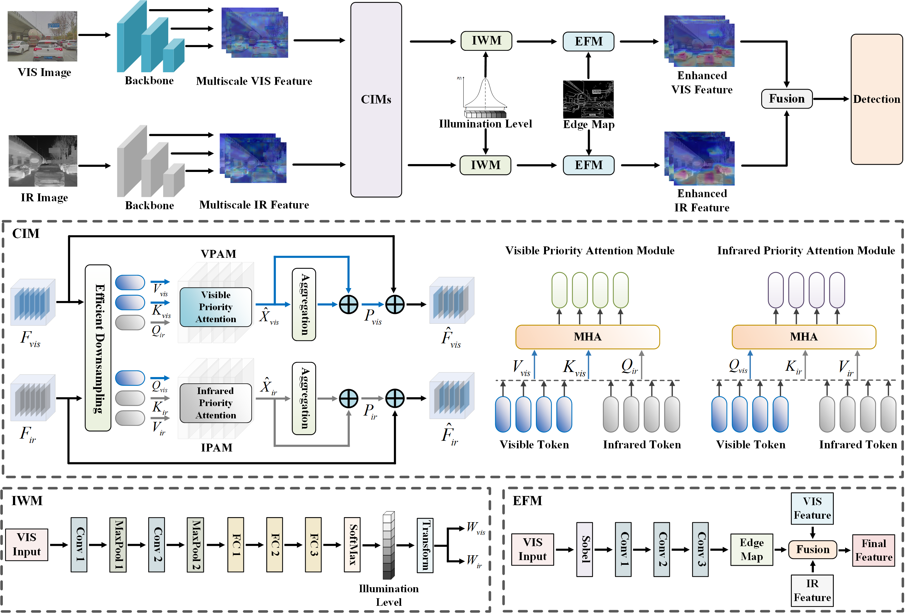

# EI²Det


**EI²Det: Edge-Guided Illumination-Aware Interactive Learning for Visible-Infrared Object Detection**  
*IEEE Transactions on Circuits and Systems for Video Technology*, 2025.

[[Paper]](https://ieeexplore.ieee.org/document/10877920)


---
<h2><p align="center">MFAD Dataset</p></h2>

### Preview


---

### Details

- **Device**: Multispectral quad-camera imaging system.  
- **Scenes**: Road, Viaduct, Tunnel, Campus, Park, Residential Area, Street, Overpass, Parking, Others.  
- **Conditions**: Sunny, Cloudy, Rainy, Foggy.  
- **Image Pairs**:  
  - **Total**: 12,194  
  - **Train/Test Split**: 9,751 / 2,443  
- **Object Classes**: {Car, Bus, Truck, Pedestrian, EbikeRider, Cyclist}   
- **Image Size**: 1280 × 960
- **Label Format**: YOLO-style `.txt` per image  

### Datasets Download
| Baidu Yun         | Google Drive                          |
|---------------|-----------------------------------------|
|📂 [MFAD](https://pan.baidu.com/s/1jAawwnsavnwyt5dIBswdgw?pwd=t4c6)       | 📂 [MFAD](https://drive.google.com/file/d/1bnNZyY7BHdCeSfH2LSjyvG9ikZzsi8qK/view?usp=sharing) |
|📂 [M3FD](https://pan.baidu.com/s/1I-PjXnZ7LtDbjDWwJGORTA?pwd=hv8c)|📂 [M3FD](https://drive.google.com/file/d/1lTCcBvbJYI8Iz0h-Qxpk-vLQXxVltOlC/view?usp=drive_link)|

---

<h2><p align="center"> EI²Det </p></h2>

### Framework

EI²Det is composed of three novel modules:

- **CIM (Cross-modal Interaction Module)**: Dual-path cross-attention for VIS/IR refinement.  
- **IWM (Illumination-aware Weighting Module)**: Dynamically weighs VIS/IR inputs based on lighting prediction.  
- **EFM (Edge-guided Fusion Module)**: Uses Sobel + conv layers to retain boundaries and guide fusion.  


---

### Quick Start

#### 1. Environment Setup

```bash
conda create -n ei2det python=3.8
conda activate ei2det
pip install -r requirements.txt
```

#### 2. Data Organization

```
EI2Det ROOT
└── dataset
    └── MFAD
        ├── visible          # visible images
        ├── infrared         # infrared images
        ├── labels           # YOLO format
```

#### 3. Inference

```bash
python test.py --data data/XXX.yaml --weights weights/XXX.pt
```

#### 4. Training

```bash
python train.py --cfg configs/XXX.yaml --data data/XXX.yaml --weights weights/XXX.pt
```

---

### Pre-trained Models

| Baidu Yun         |  Google Drive |               
|---------------|---------------|
| [EI2Det(MFAD)](https://pan.baidu.com/s/1N1waN8SsK588jG8gqpxE1Q?pwd=wvaq)        |[EI2Det(MFAD)](https://drive.google.com/file/d/1SjSCMV2jnIaoh0layOmpWCatp9FESO-p/view?usp=sharing) |
|[EI2Det(M3FD)](https://pan.baidu.com/s/1DrlVvaUPQdOflrcFiDP1pw?pwd=u3gy)| [EI2Det(M3FD)](https://drive.google.com/file/d/1CXftHq4rMvECgc09KNd_dEPniz2x299B/view?usp=sharing) |


---

### Results

#### MFAD

| Method   | mAP50 | mAP75 | mAP   |
|----------|-------|-------|-------|
| YOLOv5   | 74.9  | 52.4  | 49.1  |
| CFT      | 77.8  | 56.8  | 52.5  |
| EI²Det   | **79.0** | **58.0** | **53.3** |

*(For more results, please refer to the paper.)*

---

### Citation

If you find this repository useful, please consider citing:

```bibtex
@article{hu2025ei2det,
  title={EI²Det: Edge-Guided Illumination-Aware Interactive Learning for Visible-Infrared Object Detection},
  author={Ke Hu and Yudong He and Yuan Li and Jiayu Zhao and Song Chen and Yi Kang},
  journal={IEEE Transactions on Circuits and Systems for Video Technology},
  year={2025},
  doi={10.1109/TCSVT.2025.3539625}
}
```

---
### Acknowledgements
This implementation is based on the following repositories, and we thank the original authors for their excellent works.
- [ICAFusion](https://github.com/chanchanchan97/ICAFusion)
- [RSDet](https://github.com/Zhao-Tian-yi/RSDet)
- [TINet](https://github.com/NNNNerd/Triple-I-Net-TINet)

We would also like to thank Jinyuan Liu, Qi Xu, Tianjian Chen, Chen Chen, and Boen Wang for their helpful discussions.
